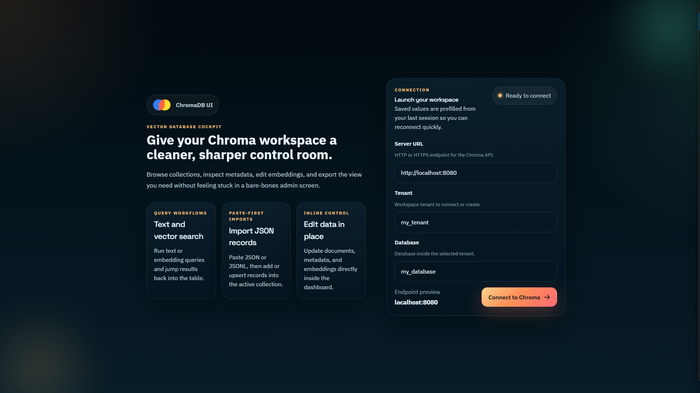
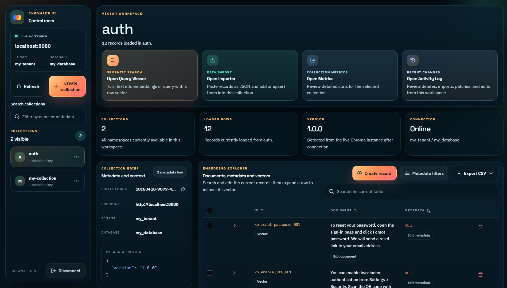
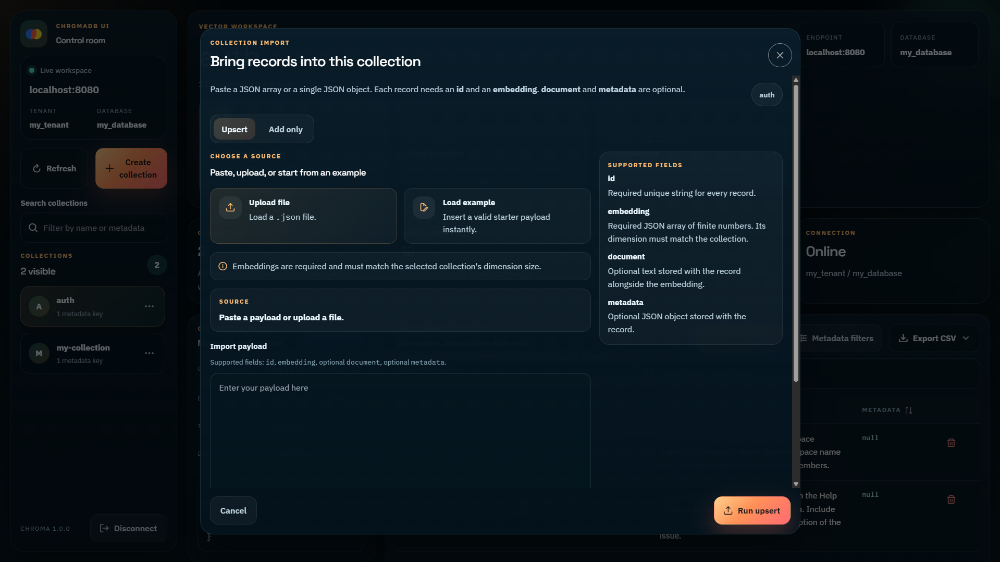
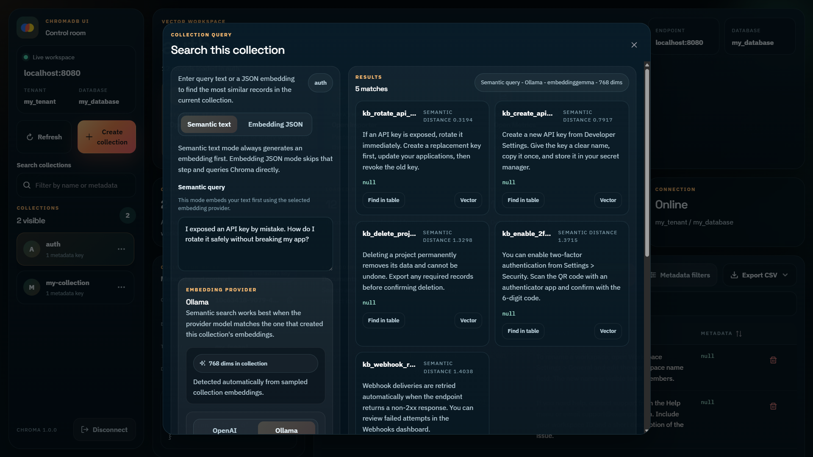
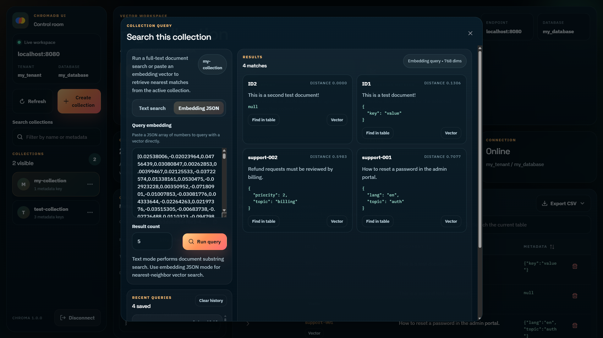

# ChromaDB UI

ChromaDB UI is a web app for exploring and managing a ChromaDB instance through a visual interface instead of raw API calls.

> [!IMPORTANT]  
> ChromaDB UI only works with the Chroma v2 API

## Showcase

<p align="center">
  
  
</p>

<p align="center">
  
  
  
</p>

## What You Can Do In The UI

- Connect to a ChromaDB server with a URL, tenant, and database.
- Browse all collections in the current workspace.
- Create, rename, and delete collections.
- Inspect and edit collection metadata and workspace details from the dashboard.
- Run text-based document search inside a collection.
- Run embedding-based nearest-neighbor search with raw vector JSON.
- Search records in the current collection.
- Build metadata filters with match-all or match-any rules for the current table view.
- Add or upsert records with IDs, embeddings, optional documents and metadata.
- Collection metrics viewer with document, metadata, and sampled embedding stats.
- Edit documents inline.
- Edit metadata inline with JSON validation.
- Expand a table row to preview that record's embedding.
- Open a full vector viewer for large embeddings.
- Edit embeddings directly and save them back to Chroma.
- Export the current table view as CSV.

## Getting Started

Follow these steps to run ChromaDB UI locally.

1. Clone the repository.

```sh
git clone https://github.com/BlackyDrum/chromadb-ui.git
```

2. Install dependencies.

```sh
npm ci
```

3. Start the development server.

```sh
npm run dev
```

The app runs on `http://localhost:8090` by default.

## Using Docker Compose for ChromaDB

This repository includes a `docker-compose.yml` file that simplifies starting a ChromaDB container.

1. Ensure Docker is installed and running on your machine.
2. Start the ChromaDB container using the following command

```sh
docker-compose up -d
```

This will start a ChromaDB instance and expose it on the appropriate port.

## Troubleshooting CORS Issues

If you encounter CORS errors while running the application, you'll need to ensure that the Chroma backend allows requests from the correct frontend origin.

### Update `config.yaml`

```yml
persist_path: "/data"
cors_allow_origins: ["http://localhost:8090"]
```

After making these changes, restart both the Docker container and the Vite development server. This should resolve the CORS issue.
